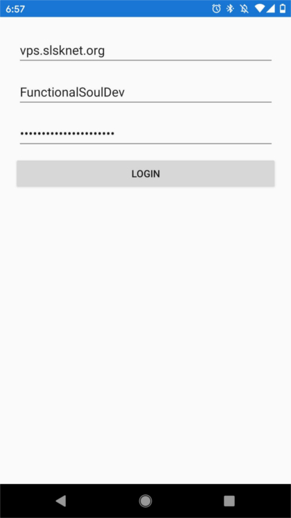
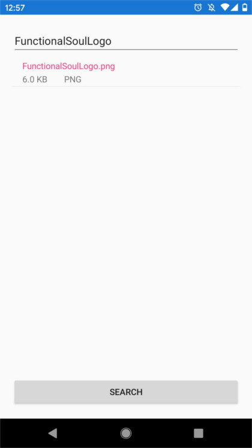
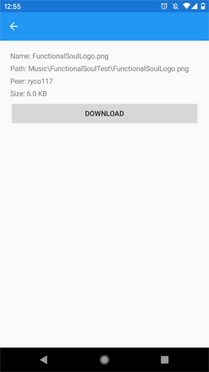
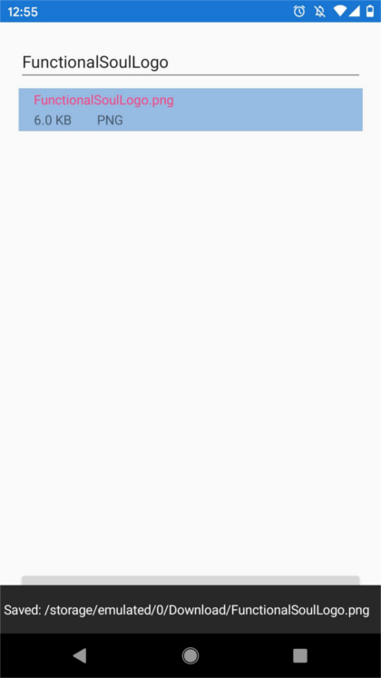

# FunctionalSoul

A [Soulseek](http://www.slsknet.org/) client app written in F#.
Uses [Fabulous](https://fsprojects.github.io/Fabulous/) for cross-platform app development with a Model-View-Update paradaigm.
The [Soulseek.NET](https://github.com/jpdillingham/Soulseek.NET) library is used for interacting with the Soulseek servers and network.

## Install
Pre-built APK's can be downloaded from the [releases](https://github.com/ryco117/FunctionalSoul/releases) page.

## Example Usage
#### Account Login / Creation

#### Network File Search

#### File Info

#### Download to Local Storage

